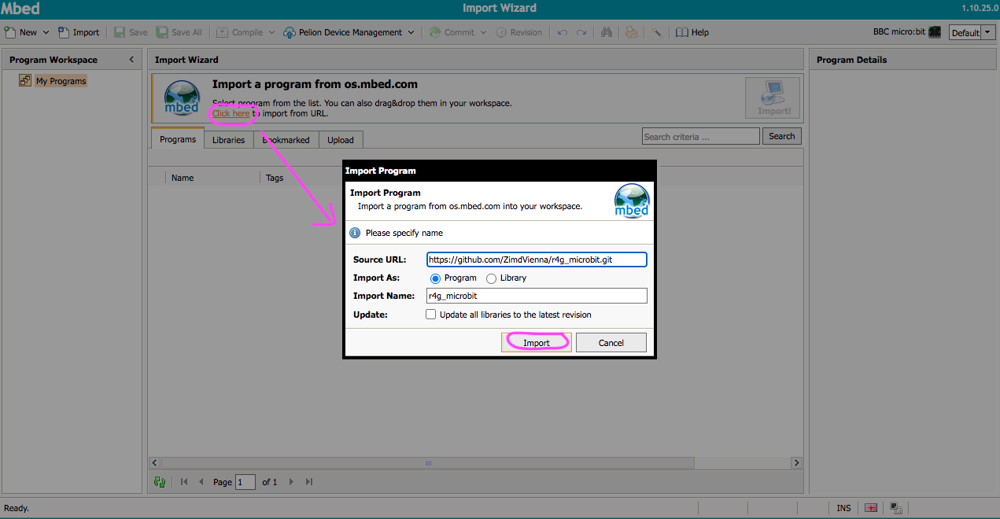

# R4G microbit
This is the Mbed project for the R4G Micro:bit program. It is programmed in C/C++ and utilizes the [lancester-university microbit runtime](https://lancaster-university.github.io/microbit-docs/).

### To change and build the micro:bit .hex file follow theese steps:
You can use either an online or offline toolchain. For changing the code offline yotta is used. It seems there are some issues lately with the yotta dependencies when trying to install yotta, I therefore recommend trying to compile the code online with the MBed compiler.

## Mbed compiler
Create an account on [Mbed](https://os.mbed.com/) and verify your email address. Log in at MBed and open your MBed compiler. You have to add the microbit platform to your devices first. On the right upper corner of the compiler, click on <i>No device selected</i>. In the window that pops up <i>Select a Platform</i>, click on + Add board. Add the BBC micro:bit from the Development boards. To that end, click on the <i>BBC micro:bit board</i>. In the [micro:bit Mbed tab](os.mbed.com/platforms/Microbit/) that opens you get additional information on how to program the micro:bit with Mbed. Scroll down a bit and click on <i>+ Add to your Mbed Compiler</i>. Change back to your compiler and open the <i>Select a Platform window</i> again. Select the BBC micro:bit. You should see the microbit icon in your compiler now. To import the r4g program click on import a program and import from URL. In the Source URL enter the link to this repository, select import as program and click import. 

For the compiler to work, delete the folder <b>yotta_modules</b> from the r4g_microbit program folder with right-click/Delete. Then compile the code. A .hex file should be created and downloaded to your computer. You can then flash it on to your microbit v1 to try it out. If it works, you can change the code in the source folder to adapt the program to your needs.

## yotta
Follow the installation instructions at [lancaster-university](https://lancaster-university.github.io/microbit-docs/offline-toolchains/), additionally or if you should run into any problems this website is very helpful too: [IOT Programmer](https://www.iot-programmer.com/index.php/books/27-micro-bit-iot-in-c/chapters-micro-bit-iot-in-c/44-offline-c-c-development-with-the-micro-bit).
Theese links are also a good resource for learning about the microbit and how to program it in C/C++.
### clone the repository
Next, clone this repository, open yotta and <b>navigate to the project folder</b>.
Set the compiler target with:

*<b>yotta target bbc-microbit-classic-gcc</b>*

### build the project
To build the project enter

*<b>yotta build</b>*

inside your yotta workspace. After yotta finished the build successfully you should have a <b>build</b> directory in your project folder. The .hex file you want to download to your micro:bit is the <b>r4g-microbit-combined.hex</b> file inside the <b>/build/bbc-microbit-classic-gcc/source</b> directory.
You can now change the main.cpp or header files in the <b>source</b> directory to your liking with an editor of your choice and rebuild it with *<b>yotta build</b>*.
